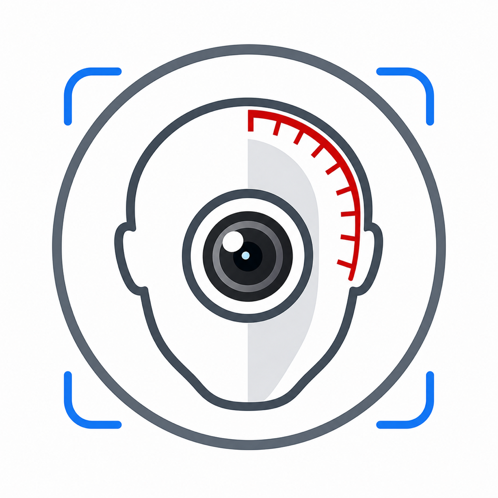
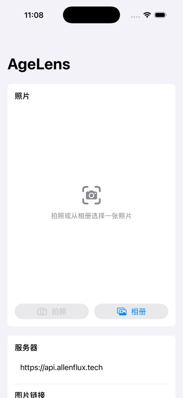
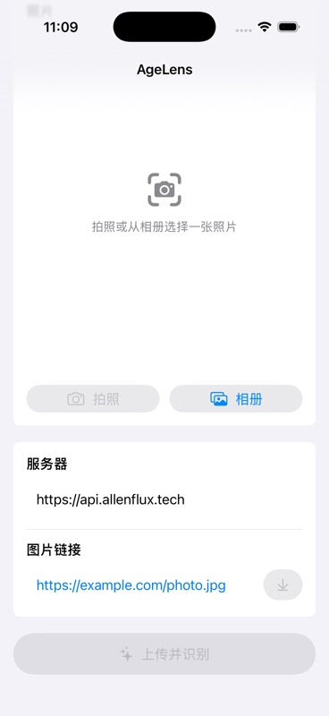

<p align="center">
  
</p>

<h1 align="center">AgeLens</h1>

<p align="center">
  A clean iOS client for MiVOLO age and gender prediction.
  <br>
  拍照、选图或输入图片链接，将图片提交到 MiVOLO 服务并展示年龄、性别和标注结果。
</p>

<p align="center">
  
  
  
</p>

## Preview

<p align="center">
  
  
</p>

## Overview

AgeLens is a lightweight SwiftUI app built for testing and using a remote [MiVOLO](https://github.com/allenflux/MiVOLO) API service. It keeps the workflow direct: choose an image, send it to the server, then review the annotated image and structured prediction data.

AgeLens 是一个轻量级 SwiftUI 应用，用于调用远程 MiVOLO API 服务。它的目标是把测试流程做得足够直接：选择图片、提交服务器、查看标注图和结构化识别结果。

## Features

- Camera capture for quick real-world testing.
- Photo library import for local image evaluation.
- Image URL input for fast remote-image testing.
- Multipart upload to the MiVOLO `/predict` endpoint.
- Annotated image rendering from base64 JPEG responses.
- Prediction detail cards for age, gender, confidence, counts, and inference time.
- Editable server URL with local persistence.

## 功能

- 支持直接拍照测试。
- 支持从 iOS 相册选择图片。
- 支持输入图片 URL，方便快速测试线上图片。
- 使用 multipart 请求上传图片到 MiVOLO `/predict` 接口。
- 展示服务器返回的 base64 标注图片。
- 展示年龄、性别、置信度、检测数量和推理耗时。
- 支持修改服务器地址，并自动保存。

## How To Use

1. Open AgeLens.
2. Choose an image source:
   - Tap `拍照` to capture a new photo.
   - Tap `相册` to choose a local image.
   - Paste an image URL into `图片链接`, then tap the download button.
3. Confirm the API server address.
4. Tap `上传并识别`.
5. Review the annotated image and prediction metadata.

Default API server:

```text
https://api.allenflux.tech
```

You can replace it in the app if you deploy your own MiVOLO service.

## 使用方式

1. 打开 AgeLens。
2. 选择图片输入方式：
   - 点击 `拍照` 拍摄新照片。
   - 点击 `相册` 选择本地图片。
   - 在 `图片链接` 输入图片 URL，然后点击右侧下载按钮。
3. 确认或修改 `服务器` 地址。
4. 点击 `上传并识别`。
5. 查看标注图片和年龄/性别识别结果。

## API Contract

AgeLens sends the selected image as a multipart form file:

```bash
POST /predict?include_image=true
Content-Type: multipart/form-data
field: file
```

Example response:

```json
{
  "status": "ok",
  "message": "Prediction completed.",
  "elapsed_ms": 1234.56,
  "counts": {
    "objects": 6,
    "faces": 3,
    "persons": 3,
    "subjects": 3
  },
  "subjects": [
    {
      "kind": "face",
      "age": 36.57,
      "gender": "male",
      "gender_score": 0.99
    }
  ],
  "annotated_image": "...base64 jpeg...",
  "annotated_image_mime": "image/jpeg"
}
```

Backend documentation:

[MiVOLO API_USAGE.md](https://github.com/allenflux/MiVOLO/blob/main/API_USAGE.md)

## Development

Requirements:

- Xcode 26.5 or newer
- iOS 17.0 or newer
- A reachable MiVOLO API server

Open the project:

```bash
open AgeLens.xcodeproj
```

Run the `AgeLens` scheme on an iOS Simulator, such as `iPhone 17`.

## Permissions

AgeLens requests:

- Camera access for taking photos.
- Photo library access for choosing images.
- HTTP access for the deployed MiVOLO API service.

The related settings are defined in:

```text
Config/Info.plist
```

## Project Structure

```text
AgeLens/
├── AgeLens/                 # SwiftUI app source
├── Config/                  # Info.plist and app runtime configuration
├── Docs/Screenshots/        # README images
├── AgeLensTests/            # Unit tests
└── AgeLensUITests/          # UI tests
```
